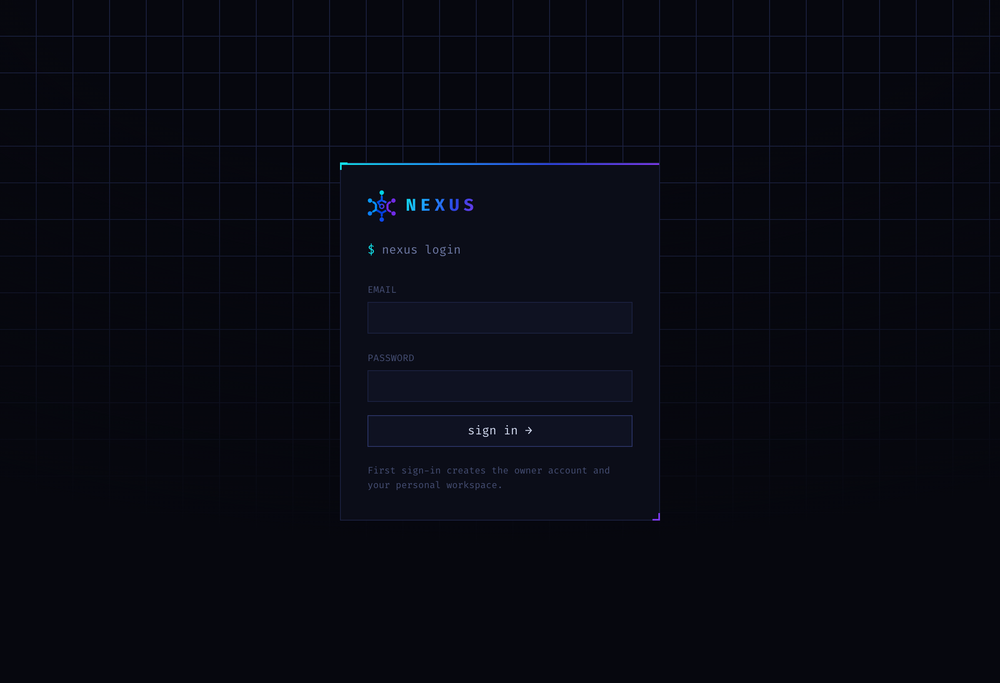

<div align="center">


### A developer operations cockpit

One terminal-style dashboard that indexes every asset you own — repos, projects, domains, databases, servers — from every provider, into one searchable, cross-linked workspace.

<br />


</div>

---

## What is Nexus?

If you ship side projects, you know the sprawl: a repo on GitHub, deployed to Vercel, on a domain at Cloudflare, backed by a Neon database. Multiply that by twenty projects and three accounts and you lose track of what exists, what's healthy, and where the console is.

**Nexus pulls it all into one place.** Connect a provider with a read-only token and Nexus syncs its resources into a normalized inventory you can search, filter, and drill into — without ever leaving the dashboard for the details, and deep-linking to the provider console for the risky stuff.

It's **monitoring-and-inventory first**: Nexus reads your infrastructure, it never mutates it.

<div align="center">
  
</div>

---

## Features

### 🔌 Connect anything
- **Integrations catalog** of 11 providers with real brand marks.
- **API-token connect flow** — tokens are verified against the provider, then **encrypted (AES-256-GCM)** before they ever touch the database. Never logged, never sent back to the browser.
- **Many accounts per provider** — connect three GitHub orgs or two Vercel accounts; each stays its own connection, and assets are tagged by source.
- Live connectors today: **GitHub** and **Vercel** (read-only). The connector interface makes adding more a small, isolated file.

### 🗂 One normalized inventory
- Everything synced becomes a typed **asset** — `repository`, `website`, `domain`, … — workspace-scoped and cross-linked.
- **Global search** (`/`) — a slide-over panel over every asset across every account, filterable by type, status, and account.
- **Overview** with live metrics: repos, projects, domains, and what needs attention.

### 🔎 Deep, cross-linked detail
- **Vercel projects** → deployment log (state, date, inspector link), production domain, framework, and the domains they serve.
- **GitHub repos** → all languages (with %), contributors with avatars, and a three-tab switcher: **README** (rendered markdown), **commits**, and a **branch diagram**.
- **Domains** surface under Infra and link back to the project that deploys them — click through the whole graph.

### 📈 Observe
- **Git** — every repository across your GitHub accounts, sorted by stars.
- **Logs** — a live stream of sync activity across all connections.

### 🔐 Secure by design
- App-level credential encryption, server-only. No plaintext secrets, ever.
- Every workspace-owned query enforces membership (ready for teams, even in single-user mode).
- V1 performs **no destructive provider actions** — it deep-links to the console instead.

### 🎨 A design with a point of view
- Terminal-style, dark-only, dense, keyboard-friendly. Every color is a CSS variable sampled from the Nexus logo gradient — retheme the whole app by editing one file.
- Instant navigation with streamed loading states, so nothing ever feels stuck.

---

## Tech stack

| Layer | Choice |
|---|---|
| Framework | **Next.js 14** (App Router, Server Actions, streaming) |
| Language | **TypeScript** |
| Database | **Neon Postgres** (serverless) |
| ORM | **Drizzle** + drizzle-kit migrations |
| Auth | Email + password, signed-JWT session (`jose`), 1h sliding session |
| Crypto | **AES-256-GCM** credential encryption (`node:crypto`) |
| Styling | **Tailwind CSS**, dark-only, logo-driven CSS variables |

---

## Getting started

Want to run your own copy? It's one Next.js app + one Postgres database. ~5 minutes.

### 1. Prerequisites
- **Node.js 18+**
- A **Neon Postgres** database — free at [neon.tech](https://neon.tech). Copy both the pooled and direct connection strings.

### 2. Clone & install
```bash
git clone https://github.com/SamNickGammer/nexus.omprakashbharti.in.git
cd nexus.omprakashbharti.in
npm install
```

### 3. Configure environment
```bash
cp .env.example .env.local
```
Then fill in `.env.local`:

| Variable | What it is | How to get it |
|---|---|---|
| `DATABASE_URL` | Neon **pooled** connection string | Neon dashboard → Connection Details |
| `DATABASE_URL_UNPOOLED` | Neon **direct** connection (for migrations) | Neon dashboard → toggle "pooled" off |
| `AUTH_SECRET` | Session signing key | `openssl rand -base64 32` |
| `NEXUS_ENCRYPTION_KEY` | Credential encryption key (32-byte base64) | `openssl rand -base64 32` |
| `APP_URL` | Public app URL | `http://localhost:3000` for local |

Generate the two secrets in one go:
```bash
echo "AUTH_SECRET=$(openssl rand -base64 32)"
echo "NEXUS_ENCRYPTION_KEY=$(openssl rand -base64 32)"
```

### 4. Create the database schema
```bash
npm run db:push
```

### 5. Run it
```bash
npm run dev
```
Open **http://localhost:3000**. **Your first sign-in creates the owner account** and a personal workspace — pick any email and a password (8+ chars).

### 6. Connect a provider
Go to **Integrations → GitHub** or **Vercel**:
- **GitHub** — create a token at [github.com/settings/tokens](https://github.com/settings/tokens) with read access to repositories.
- **Vercel** — create an account token at [vercel.com/account/tokens](https://vercel.com/account/tokens).

Paste it in, and Nexus verifies, encrypts, and runs the first sync.

### Scripts
```bash
npm run dev         # dev server
npm run build       # production build
npm run start       # serve the build
npm run lint        # eslint
npm run typecheck   # tsc --noEmit
npm run db:push     # push schema to Neon
npm run db:studio   # drizzle studio (browse the DB)
```

---

## Adding a provider

Connectors are isolated adapters in `lib/connectors/`. To add one, implement the interface in `types.ts`:

```ts
export interface Connector {
  provider: string;
  tokenHelpUrl: string;
  verify(token: string): Promise<VerifyResult>;          // confirm creds + identity
  sync(token: string, ctx?): Promise<NormalizedAsset[]>; // fetch → normalize
}
```

Register it in `lib/connectors/index.ts`, add it to the catalog in `lib/providers.ts`, and it shows up in Integrations. Sync, encryption, storage, and the UI are all handled for you — a connector only knows how to talk to its provider.

---

## Architecture

```
Browser ─▶ Next.js (Server Actions / RSC)
                 │
     ┌───────────┼─────────────┬──────────────┐
     ▼           ▼             ▼              ▼
   Auth      Neon Postgres   Crypto       Connectors ──▶ GitHub / Vercel / …
 (session)  (source of truth) (AES-GCM)   (server-only)
```

- The **UI reads normalized Nexus data only** — it never calls provider APIs directly and never receives secrets.
- **Connectors** are server-side and isolated, so one provider breaking can't take down the dashboard.
- **Neon** is the source of truth; provider credentials live encrypted in `provider_credentials`.

Full design docs live in [`doc/`](doc/).

---

## Roadmap

- [x] Auth, workspaces, encrypted credentials
- [x] GitHub + Vercel connectors, connect flow, connection management
- [x] Asset inventory, global search, cross-linked detail views
- [x] Git & Logs observability
- [ ] Databases (Neon / Supabase) connectors
- [ ] Live health checks (uptime / SSL / domain expiry)
- [ ] Background jobs & scheduled sync
- [ ] Alerts engine, Slack notifications
- [ ] Asset relationship graph

---

## Security

Provider tokens are powerful, so Nexus treats them carefully: encrypted before storage, never logged, never returned to the browser, and shown only as a `••••1234` fingerprint. `.env*` is gitignored. If you fork this, generate **your own** `AUTH_SECRET` and `NEXUS_ENCRYPTION_KEY`, and use a least-privilege database role.

---

<div align="center">
  <sub>Built with Next.js · Neon · Drizzle — a lazy senior dev's idea of a control plane.</sub>
</div>
