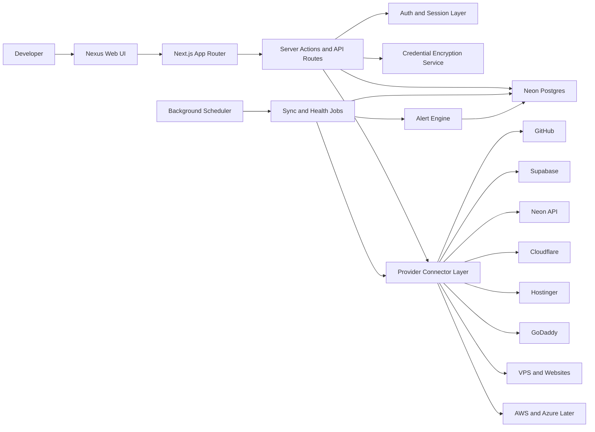
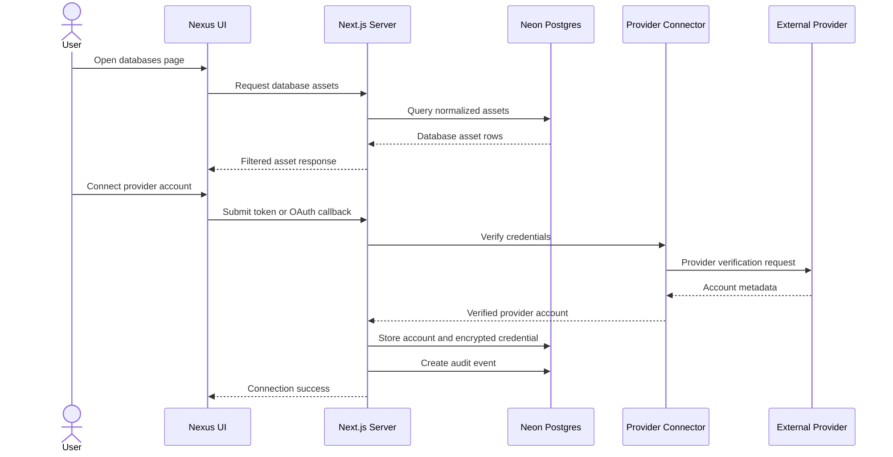

# Nexus System Architecture

## Architecture Summary

Nexus should be implemented as a full-stack Next.js application backed by Neon Postgres. The application serves the dashboard UI, API routes, server actions, provider connector logic, encrypted credential access, and background sync orchestration.

The system is built around a normalized asset graph:

- Provider accounts connect Nexus to external systems.
- Connector adapters fetch provider-specific data.
- Normalizers convert provider resources into Nexus assets.
- Assets are linked together through relationships.
- Health checks and sync jobs create alerts.
- The UI reads normalized Nexus data instead of directly calling provider APIs from the browser.

## High-Level Diagram

## Main Components

### Web UI

The Web UI is a dense developer dashboard:

- Sidebar navigation
- Overview page
- Asset list pages
- Detail pages
- Filters and search
- Connection setup flows
- Alert center
- Settings and credential status

The browser must not receive provider secrets. All provider access happens server-side.

### Next.js Server Layer

The server layer handles:

- Authenticated requests
- Workspace authorization
- CRUD for Nexus-owned metadata
- Provider connection setup
- Sync job triggering
- Data aggregation
- Search and filtering
- Alert acknowledgement
- Audit event creation

### Neon Postgres

Neon stores:

- Users and workspaces
- Provider account records
- Encrypted credentials
- Normalized assets
- Asset relationships
- Sync run history
- Health check history
- Alerts
- Audit events

Neon is the source of truth for Nexus state, not a replica of every provider.

### Provider Connectors

Each provider has an adapter with a common interface:

- Verify credentials
- Fetch provider account metadata
- Sync resources
- Normalize resources to Nexus assets
- Produce provider console deep links
- Report provider-specific errors

Connectors must be isolated so changes in one provider do not break the whole dashboard.

### Background Jobs

Background jobs run sync and health work:

- Provider sync jobs
- Health check jobs
- SSL expiry checks
- Domain expiry checks where supported
- Token verification jobs
- Alert generation jobs
- Stale data marking

Jobs should be idempotent and safe to retry.

## Data Flow

## Deployment Shape

For the first version, a simple deployment is enough:

- One Next.js app deployment
- One Neon Postgres database
- One scheduler mechanism for background jobs
- One environment encryption key
- Optional logging/monitoring provider

Later, background jobs can move into a separate worker service if sync volume grows.

## Failure Boundaries

Nexus should tolerate provider failures:

- If GitHub fails, database pages should still load.
- If one Supabase account token expires, other Supabase accounts should still sync.
- If Cloudflare rate limits a zone sync, previous zone data remains visible but marked stale.
- If background jobs fail, the UI displays last successful sync and failure details.

## Architecture Rules

- Provider secrets never leave the server.
- All external data is associated with a workspace.
- Every synced asset tracks provider source and last sync time.
- Every sync job creates a sync run record.
- Every connector normalizes data before the UI sees it.
- Every risky provider action uses a deep link in v1.

