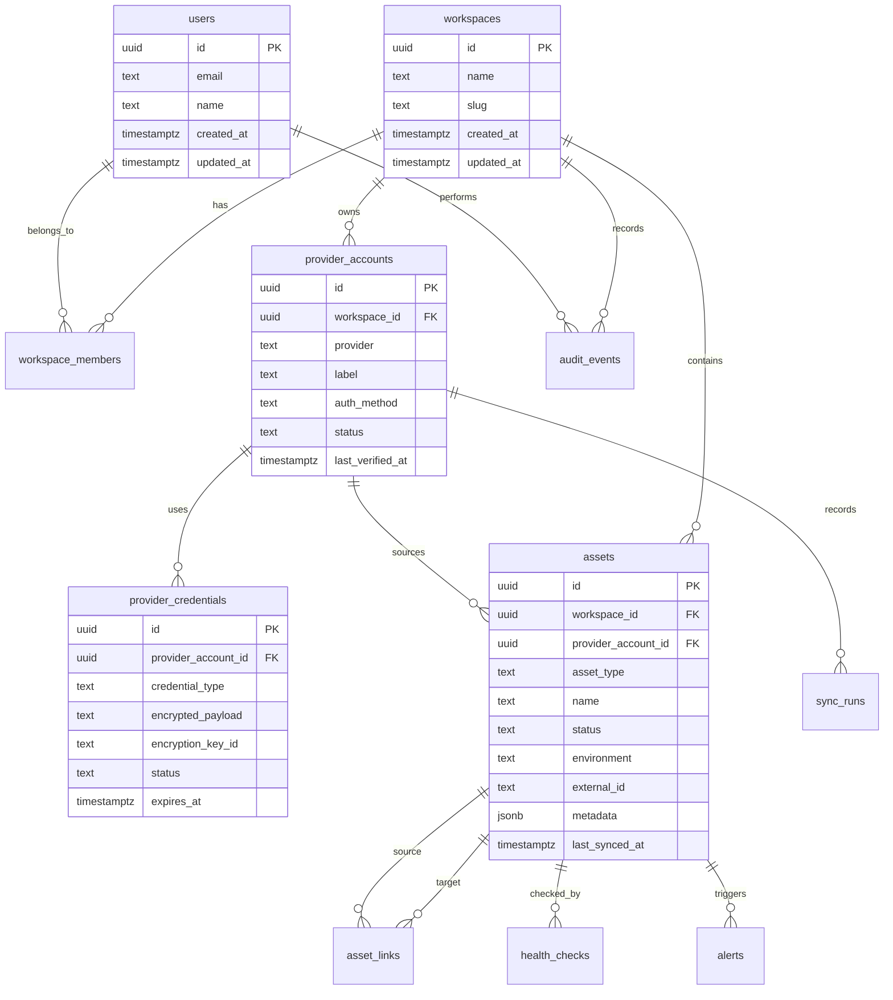

# Nexus Database Design

## Summary

Nexus uses Neon Postgres as the source of truth for app metadata, normalized assets, credentials, sync state, health checks, alerts, and audit history.

The schema should be personal-first but ready for future team support. That means every important record should belong to a workspace, even if the first workspace has only one user.

## Design Goals

- Support many provider accounts of the same type.
- Store credentials securely.
- Normalize resources across providers.
- Link related assets together.
- Track sync status and freshness.
- Support dashboard filtering and search.
- Preserve enough provider metadata for deep links and details.
- Avoid schema redesign when team features arrive.

## Entity Relationship Diagram

## Core Tables

### users

Stores Nexus users.

Recommended columns:

- `id`
- `email`
- `name`
- `avatar_url`
- `created_at`
- `updated_at`

### workspaces

Stores workspace containers. V1 can create one personal workspace automatically.

Recommended columns:

- `id`
- `name`
- `slug`
- `plan`
- `created_at`
- `updated_at`

### workspace_members

Supports future team access.

Recommended columns:

- `id`
- `workspace_id`
- `user_id`
- `role`
- `created_at`

Roles:

- `owner`
- `admin`
- `member`
- `viewer`

### provider_accounts

Stores connected provider accounts.

Recommended columns:

- `id`
- `workspace_id`
- `provider`
- `label`
- `auth_method`
- `external_account_id`
- `external_account_name`
- `status`
- `scopes`
- `last_verified_at`
- `last_sync_at`
- `created_at`
- `updated_at`

Example providers:

- `github`
- `supabase`
- `neon`
- `cloudflare`
- `hostinger`
- `godaddy`
- `manual_vps`
- `slack`
- `aws`
- `azure`

### provider_credentials

Stores encrypted secrets. This table must never expose plaintext values.

Recommended columns:

- `id`
- `provider_account_id`
- `credential_type`
- `encrypted_payload`
- `encryption_key_id`
- `status`
- `expires_at`
- `last_rotated_at`
- `created_at`
- `updated_at`

Credential types:

- `oauth_token`
- `api_token`
- `database_url`
- `ssh_key_reference`
- `webhook_secret`

### assets

Stores normalized resources.

Recommended columns:

- `id`
- `workspace_id`
- `provider_account_id`
- `asset_type`
- `name`
- `display_name`
- `status`
- `environment`
- `external_id`
- `external_url`
- `provider_console_url`
- `region`
- `tags`
- `metadata`
- `last_synced_at`
- `created_at`
- `updated_at`

Asset types:

- `domain`
- `dns_zone`
- `dns_record`
- `database_project`
- `database`
- `database_branch`
- `database_table`
- `repository`
- `website`
- `server`
- `ssl_certificate`
- `slack_workspace`
- `cloud_account`

### asset_links

Stores relationships between assets.

Recommended columns:

- `id`
- `workspace_id`
- `source_asset_id`
- `target_asset_id`
- `relationship_type`
- `confidence`
- `created_at`
- `updated_at`

Relationship types:

- `resolves_to`
- `hosted_on`
- `uses_database`
- `deployed_from`
- `contains`
- `owns`
- `monitors`
- `notifies`

### sync_runs

Tracks provider sync attempts.

Recommended columns:

- `id`
- `workspace_id`
- `provider_account_id`
- `sync_type`
- `status`
- `started_at`
- `finished_at`
- `resources_seen`
- `resources_created`
- `resources_updated`
- `resources_failed`
- `error_code`
- `error_message`
- `rate_limit_reset_at`
- `metadata`

### health_checks

Tracks website, SSL, server, and endpoint checks.

Recommended columns:

- `id`
- `workspace_id`
- `asset_id`
- `check_type`
- `status`
- `checked_at`
- `latency_ms`
- `status_code`
- `message`
- `metadata`

### alerts

Stores actionable issues.

Recommended columns:

- `id`
- `workspace_id`
- `asset_id`
- `provider_account_id`
- `severity`
- `status`
- `category`
- `title`
- `message`
- `first_seen_at`
- `last_seen_at`
- `acknowledged_at`
- `resolved_at`
- `metadata`

### audit_events

Tracks user and system actions.

Recommended columns:

- `id`
- `workspace_id`
- `user_id`
- `actor_type`
- `event_type`
- `target_type`
- `target_id`
- `message`
- `ip_address`
- `metadata`
- `created_at`

## JSON Metadata Strategy

Use normalized columns for filtering and cross-provider views. Use `metadata jsonb` for provider-specific details.

Good normalized columns:

- name
- status
- provider
- environment
- region
- external id
- provider console URL
- last synced time

Good JSON metadata:

- provider-specific IDs
- raw counts
- branch settings
- database sizes
- nameserver arrays
- DNS record options
- API version details

## Indexing Strategy

Recommended indexes:

- `workspace_id` on every workspace-owned table
- `(workspace_id, provider)`
- `(workspace_id, asset_type)`
- `(workspace_id, status)`
- `(workspace_id, last_synced_at)`
- GIN index on tags
- GIN index on metadata for selected search use cases
- unique provider identity index on `(provider_account_id, asset_type, external_id)`

## Data Retention

Keep current asset metadata indefinitely unless the user deletes it. Keep sync and health history with retention policies:

- Sync runs: 90 to 180 days
- Health checks: 30 to 90 days at high resolution
- Aggregated uptime history: longer-term
- Audit events: 1 year or longer for security-sensitive actions

