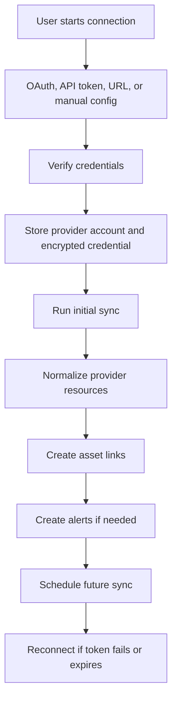

# Nexus Integrations and Connectors

## Connector Strategy

Nexus should treat each external service as a provider connector. A connector is a server-side adapter that verifies credentials, fetches resources, converts provider-specific resources into normalized Nexus assets, creates asset links, and reports failures.

The UI should never call provider APIs directly. The UI reads Nexus data from Neon.

## Connector Lifecycle

## Common Connector Interface

Each connector should implement:

- `provider`: stable provider key
- `verifyConnection(input)`: confirms credentials and returns account metadata
- `syncAccount(accountId)`: fetches provider resources
- `normalize(resource)`: maps raw provider resources to Nexus assets
- `buildDeepLink(resource)`: returns provider console URLs
- `handleError(error)`: maps provider errors to Nexus error codes
- `supportsFeature(feature)`: declares optional capabilities

## GitHub

Primary resources:

- Repositories
- Branches
- Pull request counts
- Issue counts
- Workflow status where supported
- Recent commits
- Organization/user account metadata

Useful Nexus asset types:

- `repository`
- `git_branch`
- `deployment_workflow`

V1 behavior:

- Sync repository inventory and key metadata.
- Display repo status, language, visibility, default branch, last pushed time, and deep link.
- Do not perform destructive repo management in v1.

## Supabase

Primary resources:

- Organizations
- Projects
- Database metadata
- Auth/storage/functions metadata where available
- Project status and region

Useful Nexus asset types:

- `database_project`
- `database`
- `storage_bucket`
- `edge_function`

V1 behavior:

- Support many Supabase accounts.
- Sync project and database metadata.
- Show linked project console.
- Track failed or disconnected tokens.
- Avoid direct data mutation from Nexus v1.

## Neon

Primary resources:

- Projects
- Branches
- Databases
- Roles
- Compute endpoints
- Regions

Useful Nexus asset types:

- `database_project`
- `database_branch`
- `database`
- `database_role`
- `database_endpoint`

V1 behavior:

- Store Nexus application data in Neon.
- Also support connecting separate Neon accounts as managed provider accounts.
- Clearly separate the Nexus internal database from external databases shown in the dashboard.

## Cloudflare

Primary resources:

- Accounts
- Zones
- DNS records
- SSL/TLS state
- Workers, Pages, and other resources later

Useful Nexus asset types:

- `dns_zone`
- `dns_record`
- `domain`
- `ssl_certificate`
- `edge_worker`

V1 behavior:

- Sync zones and DNS records.
- Highlight DNS records pointing to known Nexus websites or servers.
- Show provider deep links for DNS edits.
- Avoid editing DNS records inside Nexus v1 unless a later phase adds explicit review flows.

## Hostinger

Primary resources:

- Domains
- Hosting accounts
- VPS instances
- Websites
- WordPress installs where supported by API

Useful Nexus asset types:

- `domain`
- `hosting_account`
- `server`
- `website`
- `wordpress_site`

V1 behavior:

- Prefer read-only inventory.
- If API coverage is limited, allow manual records with provider deep links.
- Track health and SSL from outside the provider API.

## GoDaddy

Primary resources:

- Domains
- DNS records
- Expiry dates
- Contacts where permitted

Useful Nexus asset types:

- `domain`
- `dns_zone`
- `dns_record`

V1 behavior:

- Sync domain inventory and DNS metadata where available.
- Warn about expiry and DNS mismatches.
- Use deep links for registrar actions.

## VPS and Manual Servers

Some resources will not have a clean provider API. Nexus should support manual entries.

Manual server fields:

- Name
- Provider label
- IP address
- SSH host
- SSH port
- Operating system
- Region
- Environment
- Linked websites
- Notes

V1 behavior:

- Run HTTP health checks.
- Run SSL checks.
- Optionally support SSH metadata collection later.
- Do not run arbitrary remote commands in v1.

## Slack

Slack should begin as a notification channel, not a resource management integration.

V1 or near-future behavior:

- Connect Slack workspace.
- Choose alert channels.
- Send token failure, uptime, SSL, and sync failure notifications.
- Store webhook or OAuth credentials encrypted.

## AWS and Azure

AWS and Azure should be future modules because they add complexity:

- Many resource types
- Strong IAM requirements
- Account/subscription hierarchy
- Regional APIs
- Cost and security implications

Initial future scope:

- Account/subscription inventory
- DNS zones
- Databases
- VM instances
- Static sites
- Health status
- Deep links

## Connector Error Categories

- `invalid_credentials`
- `insufficient_scope`
- `rate_limited`
- `provider_unavailable`
- `resource_not_found`
- `schema_changed`
- `network_error`
- `unknown_error`

## Provider API Rule

Provider APIs change. Before implementing each connector, verify current provider documentation and confirm authentication, scope, pagination, rate limit, and available resource endpoints.

