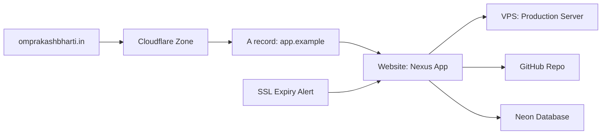

# Nexus UI and UX Design

## Design Direction

Nexus should feel like an operations console for a serious developer. It should be dense, fast, and calm. The UI should prioritize scanning, filtering, and understanding relationships over decorative marketing layouts.

The dashboard should not open with a landing page. The first screen after login should be the actual operating view.

## Layout

Primary structure:

- Persistent left sidebar
- Top search and command area
- Main content area
- Optional right detail/inspector panel
- Status strip for sync and alert health

Sidebar sections:

- Overview
- Domains & DNS
- Databases
- Websites
- Servers
- Git
- Logs
- Alerts
- Integrations
- Settings

## Overview Page

The Overview page should answer:

- What is broken?
- What is expiring?
- Which accounts are disconnected?
- Which sites are unhealthy?
- Which databases or repos changed recently?
- Which assets need attention?

Recommended modules:

- Critical alerts
- Provider connection health
- Website uptime summary
- SSL/domain expiry list
- Recent sync failures
- Recently changed assets
- Quick filters by provider/account/client/environment

## Global Search

Search should find:

- Domains
- DNS zones
- DNS records
- Databases
- Tables
- Repositories
- Websites
- Servers
- Provider accounts
- Alerts

Search result rows should show:

- Asset name
- Asset type
- Provider
- Account label
- Status
- Last sync time

## Databases Page

List view columns:

- Name
- Provider
- Account
- Project
- Environment
- Region
- Status
- Linked sites
- Linked repos
- Last synced

Filters:

- Provider
- Account
- Database type
- Project
- Environment
- Region
- Status
- Tags

Database detail should show:

- Provider and account
- Project/branch info
- Connection status
- Tables and schema metadata if enabled
- Linked websites
- Linked repositories
- Recent sync runs
- Related alerts
- Provider console link

## Domains and DNS Page

List view columns:

- Domain or zone
- Registrar
- DNS provider
- Nameservers
- Expiry
- SSL state
- Linked websites
- Status

Detail view should show:

- DNS records
- Registrar metadata
- Cloudflare zone metadata
- Nameserver mismatches
- SSL status
- Linked websites and servers
- Provider console links

## Websites Page

List view columns:

- Website name
- URL
- Environment
- Hosting provider
- Server
- Status
- HTTP code
- SSL expiry
- Last checked

Detail view should show:

- Health history
- SSL certificate details
- Linked domain
- Linked database
- Linked repository
- Deployment notes
- Provider/deploy links

## Servers Page

List view columns:

- Server name
- Provider
- Hostname/IP
- Environment
- Linked websites
- Status
- Last checked

V1 should keep server management light. Avoid pretending Nexus can safely manage all VPS operations until remote command execution is designed.

## Git Page

List view columns:

- Repository
- Owner
- Visibility
- Default branch
- Primary language
- Open PRs
- Open issues
- Last pushed
- Linked websites/databases

Detail view should show:

- Repository metadata
- Branches
- Recent activity
- Linked websites
- Linked databases
- Workflow/deploy links
- GitHub deep link

## Alerts Page

Alert fields:

- Severity
- Category
- Title
- Related asset
- Provider account
- First seen
- Last seen
- Status

Alert states:

- Open
- Acknowledged
- Resolved
- Suppressed

Severity:

- Critical
- Warning
- Info

## Integrations Page

Each provider card should show:

- Provider name
- Connected account count
- Last sync
- Status
- Common scopes
- Connect button
- Documentation/help link

Connected account row:

- Label
- External account name
- Status
- Last verified
- Last sync
- Reconnect action
- Disconnect action

## Asset Graph

The asset graph is a signature Nexus feature.

Example:



Graph behavior:

- Start simple with relationship lists.
- Add visual graph later.
- Allow filtering by provider, environment, account, and client.
- Highlight broken links or stale assets.

## Empty States

Empty states should be direct:

- No databases yet: connect Supabase, Neon, or add a manual database.
- No domains yet: connect Cloudflare, GoDaddy, Hostinger, or add a domain manually.
- No websites yet: add a website URL to begin health checks.
- No alerts: everything monitored is currently healthy.

## Error States

Error states should explain:

- What failed
- Which provider or account failed
- When it failed
- What Nexus will do next
- What the user can do

Example:

```text
Cloudflare sync failed because the token no longer has zone read access. Reconnect the account or update the token scopes.
```

## Visual Tone

Recommended tone:

- Compact
- High contrast
- Data-first
- Minimal decoration
- Strong status indicators
- Clear iconography
- Keyboard-friendly

Avoid:

- Oversized hero sections
- Marketing cards
- Decorative gradients as the main design idea
- Low-density dashboards
- Vague labels like "things" or "resources" when a precise term exists

