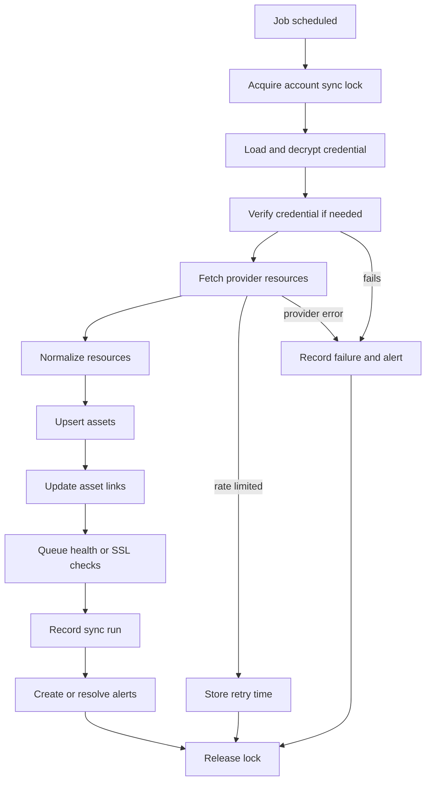

# Nexus Background Jobs and Sync

## Summary

Nexus depends on background jobs to keep provider data fresh without requiring the user to manually refresh every page.

Jobs should be safe, idempotent, observable, and tolerant of provider failures.

## Sync Flow

## Job Types

### Provider Sync Jobs

Fetch provider metadata and update Nexus assets.

Examples:

- GitHub repository sync
- Supabase project sync
- Neon project/database sync
- Cloudflare zone/DNS sync
- Hostinger inventory sync
- GoDaddy domain sync

### Health Check Jobs

Check external availability.

Examples:

- HTTP status check
- HTTPS availability
- SSL certificate expiry
- DNS resolution
- Database connectivity for manually connected read-only databases

### Token Verification Jobs

Verify provider credentials on a schedule.

Examples:

- OAuth token refresh test
- API token scope check
- Database URL connectivity test

### Alert Jobs

Create, update, or resolve alerts.

Examples:

- Website down
- SSL expires soon
- Token expired
- Sync failed
- Data stale

## Recommended Schedules

Initial schedule suggestions:

- Provider account verification: every 12 to 24 hours
- GitHub repo metadata: every 6 to 12 hours
- Supabase/Neon metadata: every 6 to 12 hours
- Cloudflare DNS metadata: every 6 to 12 hours
- Website HTTP checks: every 5 to 15 minutes
- SSL expiry checks: every 12 to 24 hours
- Domain expiry checks: every 24 hours
- Manual sync: on demand

Schedules should be configurable later.

## Idempotency

Every job should be safe to retry.

Rules:

- Use stable provider external IDs.
- Upsert assets by `(provider_account_id, asset_type, external_id)`.
- Do not create duplicate alerts for the same active problem.
- Store sync run status separately from asset state.
- Keep previous data if a sync fails.

## Rate Limits

Provider APIs may rate limit requests.

Handling:

- Track rate limit headers where available.
- Store `rate_limit_reset_at` in `sync_runs`.
- Back off repeated failed syncs.
- Avoid syncing all accounts at exactly the same time.
- Support manual sync but respect active rate limits.

## Stale Data

Assets should show freshness.

Suggested freshness states:

- Fresh: synced recently
- Aging: not synced within normal schedule
- Stale: missed multiple sync windows
- Unknown: never synced successfully

The UI should show last successful sync time and last failure.

## Sync Failure Behavior

If sync fails:

1. Record sync run as failed.
2. Keep previous assets visible.
3. Mark provider account degraded if failures continue.
4. Create or update alert.
5. Show error category and safe message.
6. Retry based on schedule and failure type.

## Initial Sync

After connecting a provider:

1. Verify credentials.
2. Create provider account.
3. Store encrypted credential.
4. Queue initial sync.
5. Show progress state.
6. Display assets as soon as they are available.

## Manual Sync

Manual sync should:

- Require authenticated user.
- Check workspace permission.
- Respect provider rate limits.
- Create sync run.
- Return sync status to UI.

## Alert Generation

Alert engine should compare current state with previous state.

Examples:

- If website was healthy and now fails, create alert.
- If SSL has fewer than configured days remaining, create alert.
- If token verification fails, create alert.
- If sync succeeds after token reconnect, resolve related credential alert.

## Observability

Every job should record:

- Job type
- Provider account
- Started time
- Finished time
- Status
- Resource counts
- Error code
- Error message
- Rate limit details

This makes Nexus itself debuggable.

